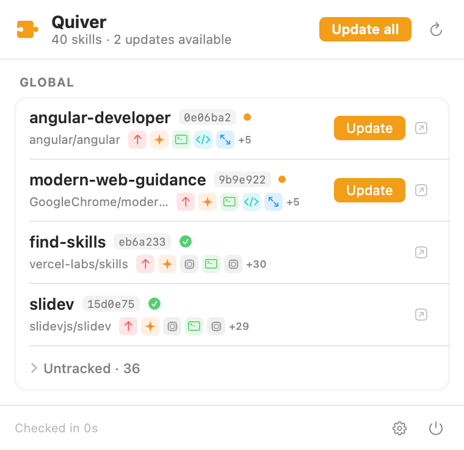

# Quiver

A macOS menu-bar app that gives you one unified, cross-agent view of every
[skills.sh](https://skills.sh) skill you've installed — across Claude Code, Codex,
Cursor, and ~20 other agents — and tells you which ones have an upstream update.



## What it does

- **Discovers** every skill — global, plus across all your projects — via the `skills` CLI (the
  menu-bar panel) and a recursive dev-folder scan (the dashboard).
- **Detects updates** by comparing each skill's folder git tree-SHA against GitHub — global skills
  from the lockfile, **project-local skills computed on disk** (so those are updatable too).
- **Updates in one click** (`skills update`), with an "Update all".
- **Dashboard window**: every skill across every project in a sortable, filterable table, each tagged
  **Local / Linked / Global / External** so you see at a glance whether a project's skill is its own
  copy or a symlink into the global install. Git worktrees are grouped under their main repo
  (`repo › worktree`). Filter by project, scope, link type, or pending updates.
- **Links out** — click a row for its skills.sh page, the glyph for its GitHub repo.
- Lives in the menu bar (no Dock icon), launches at login, refreshes in the background.

**Privacy**: the project scan only looks in dev folders (`~/workspace`, `~/Developer`, `~/code`, …) and
**never touches Documents, Desktop, Downloads, Music, Pictures**, or other protected folders — so it
won't set off macOS privacy prompts. Point it at a custom root in Settings if your code lives elsewhere.

No account, no database, no third-party dependencies. The only thing it persists is a
small JSON update-cache (so badges survive relaunch and GitHub isn't hammered).

## Requirements

- macOS 14+
- Node (`npx`) on your login shell, or the `skills` binary — Quiver resolves it for you.
- Optional: a GitHub PAT (Settings) to raise the update-check rate limit 60 → 5000/hr.

## Build & run

```bash
scripts/build-app.sh        # release build → dist/Quiver.app (ad-hoc signed)
open dist/Quiver.app
```

Dev verification hooks (headless, no GUI):

```bash
.build/debug/Quiver --scan-dump --check          # global+manual discovery + update status
.build/debug/Quiver --scan-projects [root] --check   # recursive multi-project scan + status
.build/debug/Quiver --render-png panel.png       # rasterize the panel to a PNG
.build/debug/Quiver --dashboard                  # launch with the dashboard window open
```

## Package a DMG

```bash
scripts/make-dmg.sh                          # ad-hoc DMG (this Mac only)
DEVELOPER_ID="Developer ID Application: …" \
NOTARY_PROFILE="quiver-notary" scripts/make-dmg.sh   # signed + notarized
```

> Not App Store: Quiver shells out to a CLI and reads arbitrary paths, which the
> sandbox forbids. Distribution is via signed + notarized DMG.

## How it works (verified against `skills` CLI v1.5.13)

| Concern | Reality |
|---------|---------|
| Discovery | `skills list -g\|-p --json` → `[{name, path, scope, agents[]}]`. Default scope is project; Quiver queries both. |
| Provenance | Global lock `~/.agents/.skill-lock.json` (rich, has `skillFolderHash` = git tree SHA). Project lock `<root>/skills-lock.json` (lean, `computedHash`). Joined to the list **by name**. |
| Update check | `GET /repos/{repo}/git/trees/{defaultBranch}?recursive=1`, match the entry whose path is the skill folder (`dirname(skillPath)`), compare its `sha` to the installed `skillFolderHash`. ETag-cached, 6h cadence, truncated-tree fallback. |
| Cross-agent | A skill in the shared `.agents/skills` dir belongs to many agents at once — shown as agent chips on a single row, never duplicated. |

## Limitations (MVP)

- Update detection: global skills compare the lockfile's git tree-SHA; **project-local**
  skills compute their folder's git tree-SHA on disk and compare to upstream (so they're
  updatable too). Skills not installed from a known source still show as *untracked*.
- First multi-project scan reads every project-local skill folder to hash it (then cached by
  a metadata signature, so re-scans are cheap). It runs in the background; globals show first.
- The GitHub PAT lives in the Keychain; everything else is UserDefaults.
