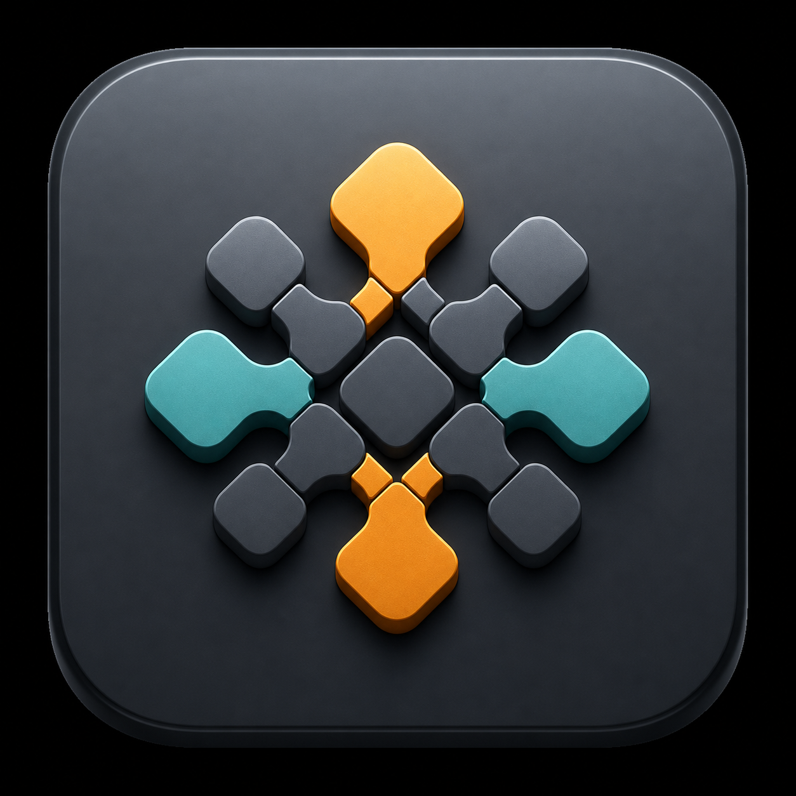

# Skillui

**Keep every [`skills.sh`](https://skills.sh) install visible and up to date—across coding agents,
projects, and Git worktrees.**

Skillui is a native macOS menu-bar app for developers who use skills across Claude Code, Codex,
Cursor, and other compatible agents. It discovers global and project-local skills, shows where each
copy comes from, detects upstream updates, and runs updates through the official `skills` CLI.

<p align="center">
  <a href="https://github.com/neogenz/skillui/releases"><strong>Download the latest beta</strong></a>
  · <a href="https://github.com/neogenz/skillui/releases">Release notes</a>
  · <a href="https://github.com/neogenz/skillui/issues">Report an issue</a>
</p>

<p align="center">
  
</p>

> [!NOTE]
> Skillui is in public beta. It requires macOS 26 or later and Node.js (`npx`) or the `skills` CLI.

## Install

1. Download the newest `Skillui-*.dmg` from [GitHub Releases](https://github.com/neogenz/skillui/releases).
2. Open the DMG and drag **Skillui** to **Applications**.
3. Launch Skillui. It lives in the menu bar and does not add a Dock icon.

Public beta DMGs are signed and notarized. Skillui checks GitHub Releases for newer versions, shows
the release notes, and lets you download the next DMG; it never silently replaces itself.

## Why Skillui?

Installing an agent skill is easy. Once several agents, projects, and worktrees are involved, it
gets harder to answer basic questions:

- Which skills are installed, and in which projects?
- Is a project using its own copy or a link to the global install?
- Which worktrees are missing skills declared in their lockfile?
- Which installed skills have changed upstream?

Skillui answers those questions in one native utility—without an account, a database, or a service
running in the cloud.

## What it does

- **Discovers global and project skills.** The menu-bar panel reads the `skills` CLI; the dashboard
  recursively scans your development folders.
- **Explains provenance.** Every dashboard row is tagged **Local**, **Linked**, **Global**, or
  **External**, so you can see whether a project owns a copy or links to another install.
- **Detects upstream updates.** Global and supported project-local skills are compared with their
  GitHub source without mutating the install.
- **Updates on demand.** Update one skill, update all, or install skills missing from a project or
  worktree through the `skills` CLI.
- **Understands Git worktrees.** Related worktrees are grouped below their main repository and can be
  filtered together.
- **Links to the source.** Open a skill on skills.sh or jump to its GitHub repository from the app.
- **Stays out of the way.** No Dock icon, optional launch at login, background refresh, and native
  light and dark modes.

## Privacy and local data

Skillui scans development roots such as `~/workspace`, `~/Developer`, and `~/code`. It deliberately
excludes macOS personal and protected folders, including Documents, Desktop, Downloads, Music,
Pictures, Movies, and Library. You can choose a custom development root in Settings.

There is no account and no database. The app uses system frameworks only and stores:

- preferences in UserDefaults;
- an optional GitHub personal access token in Keychain;
- a small local JSON cache for GitHub update checks.

Discovery works offline. GitHub access is used for upstream update badges and application release
checks; skill installs and updates run only after an explicit action.

## Requirements

- macOS 26 or later (the SwiftUI Liquid Glass baseline);
- Node.js with `npx` available from your login shell, or the `skills` binary;
- optional: a GitHub personal access token in Settings to raise the update-check limit from 60 to
  5,000 requests per hour.

## Build from source

Skillui uses Swift 6, SwiftUI, and Swift Package Manager with no third-party package dependencies.

```bash
swift test
scripts/build-app.sh release
open dist/Skillui.app
```

The application bundle is required for the menu-bar and launch-at-login features. Running the bare
SwiftPM executable is useful only for the headless development hooks below.

### Headless development hooks

```bash
.build/debug/Skillui --scan-dump --check
.build/debug/Skillui --scan-projects [root] --check
.build/debug/Skillui --render-png panel.png
.build/debug/Skillui --dashboard
```

### Package a DMG

```bash
scripts/make-dmg.sh

DEVELOPER_ID="Developer ID Application: …" \
NOTARY_PROFILE="skillui-notary" \
scripts/make-dmg.sh
```

Skillui is not distributed through the Mac App Store: it shells out to the `skills` CLI and reads
user-selected development paths, which are incompatible with the App Sandbox.

## How update detection works

Verified against `skills` CLI v1.5.13:

| Concern | How Skillui handles it |
| --- | --- |
| Discovery | Runs `skills list -g\|-p --json` for global and project scopes, then joins results to their lockfiles. |
| Provenance | Reads the global `~/.agents/.skill-lock.json` and each project `skills-lock.json`, then classifies the on-disk path. |
| Global update check | Compares the locked `skillFolderHash` with the matching folder tree SHA from GitHub. |
| Project update check | For supported root `SKILL.md` installs, compares the lockfile `computedHash` with the same single-file hash used by the CLI. |
| Cross-agent display | Shows one shared skill once, with its compatible agents attached, instead of duplicating the row. |

Update checks are grouped by repository, cached with ETags and a six-hour TTL, and never invoke
`skills update`. Mutating commands run only when you choose an update or install action.

## Current limitations

- Complex project v1 locks do not expose a reliable upstream hash. Skillui leaves them without an
  update badge rather than reporting a false update.
- Skills without a known Git source are shown as **Untracked** and are not offered a misleading
  install or update action.
- The recursive project scan runs in the background, so global skills appear first.
- Application updates open a downloaded DMG; they are not silent in-place updates.

## Contributing and releases

Bug reports and focused contributions are welcome. Read [CONTRIBUTING.md](CONTRIBUTING.md) before
opening a pull request, and report security issues through [SECURITY.md](SECURITY.md).

Releases are tag-driven:

```bash
scripts/release.sh 0.1.0
git tag -a v0.1.0 -m "Skillui 0.1.0"
git push origin v0.1.0
```

The GitHub workflow runs the tests, builds and notarizes the DMG, extracts the matching
[CHANGELOG.md](CHANGELOG.md) section, and uploads the DMG with its SHA-256 checksum. See
[docs/release.md](docs/release.md) for the complete release process.

## License

[MIT](LICENSE)
